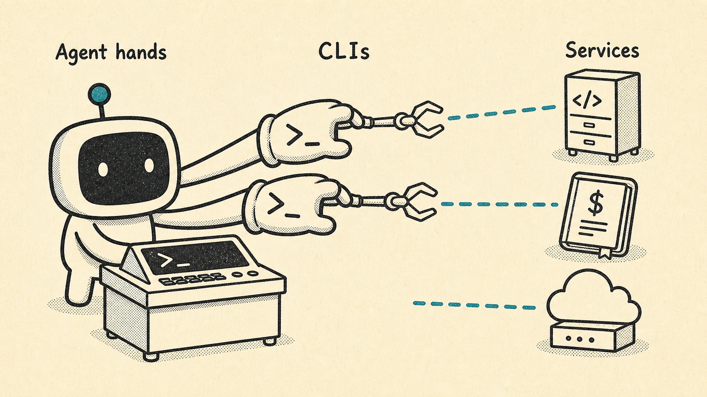
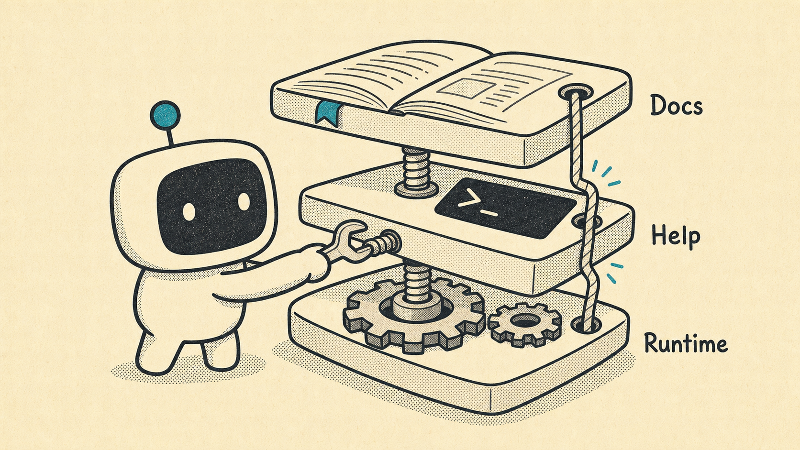
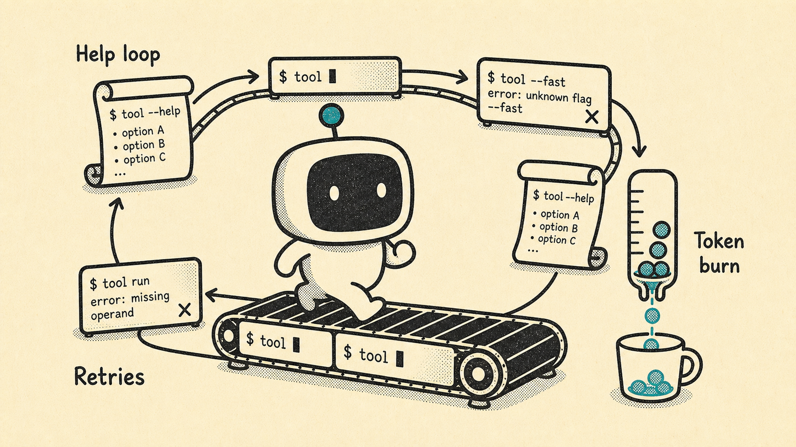
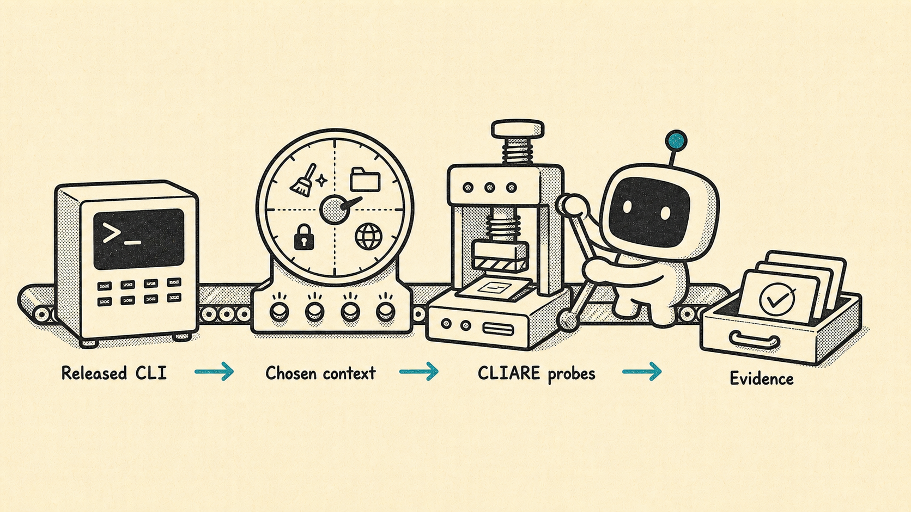
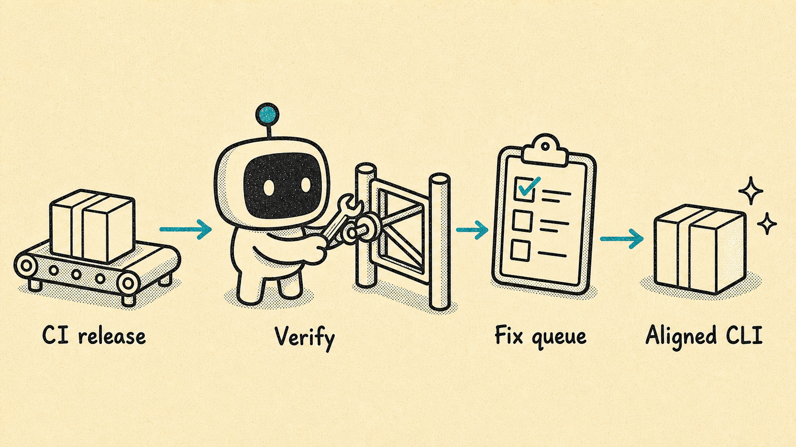
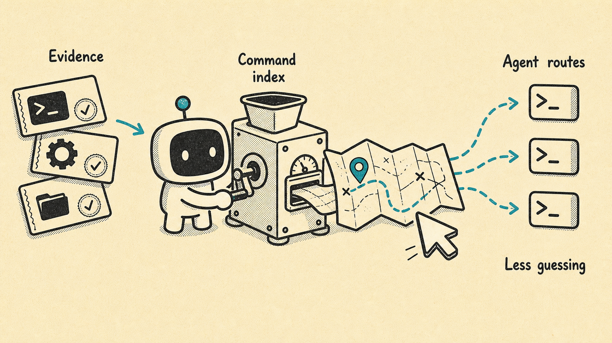
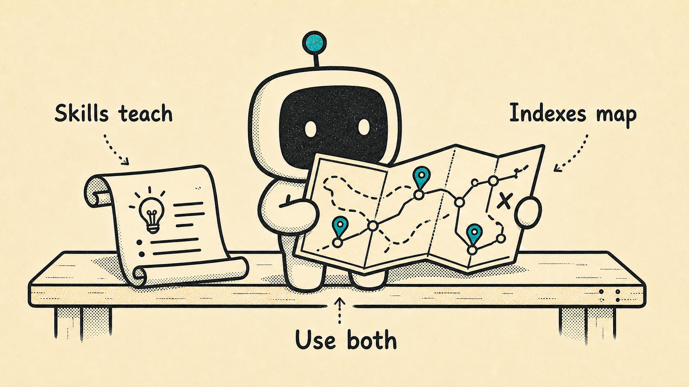

# CLIARE Storybook

This section mirrors the storybook now embedded in `README.md`. Image paths are
relative to this `docs/` directory.

## CLIARE: from CLI drift to agent-ready command indexes

CLIARE is pronounced like "Claire": she cares about whether your CLI can be used
reliably by agents, maintainers, and security reviewers.

### 1. CLIs are becoming agent hands



Agents increasingly use CLIs as their hands: the practical surface for reaching
code hosts, cloud systems, payment services, internal platforms, and local
developer workflows.

```sh
cargo install cliare
cliare metadata --format json
```

### 2. CLI surfaces drift as they grow



When a CLI evolves quickly, the docs, `--help`, and the released binary can
start telling different stories. Humans can work around that drift. Agents tend
to discover it the expensive way.

```sh
cliare measure mycli --out .cliare/mycli --profile standard --refresh
```

### 3. Drift becomes token burn



Without an evidence-backed command index, an agent harness has to rediscover the
surface repeatedly: run help, try a flag, hit a missing operand, back up, and
try again. That loop costs tokens, latency, and reliability.

```sh
cliare issues list --out .cliare/mycli --format human
```

### 4. CLIARE probes the CLI like an agent would



CLIARE exercises the released binary as a black box. You choose the context:
clean, repository, authenticated, host, fixture-backed, or CI. CLIARE records
evidence instead of relying on stale assumptions.

```sh
cliare measure mycli \
  --out .cliare/mycli \
  --context authenticated \
  --auth-state present \
  --execution-mode host \
  --profile deep \
  --refresh
```

### 5. Maintainers get a release-time fix queue



For maintainers, CLIARE turns agent-readiness gaps into a concrete queue:
missing help, confusing diagnostics, parseable-output gaps, unsafe discovery
side effects, precondition blockers, and command-shape drift.

```sh
cliare report maintainer --out .cliare/mycli --format markdown
cliare issues list --out .cliare/mycli --format markdown
cliare playbook maintainer --target mycli
```

### 6. Harnesses get a command index



For agent harnesses, CLIARE builds the map: an evidence-backed command index
that describes command paths, flags, operands, preconditions, output contracts,
confidence, suitability, and evidence references.

```sh
cliare describe .cliare/mycli --write
cliare report harness --out .cliare/mycli --write
cliare playbook harness --target mycli
```

The harness can then load:

```text
.cliare/mycli/command-index.json
.cliare/mycli/AGENT_SKILL.md
.cliare/mycli/persona-harness.json
```

### 7. Skills teach; indexes map



Skills are useful, but they are not command indexes. A skill can teach intent,
workflow, and policy. A command index tells the harness what the CLI actually
supports right now. Agents need both: instruction for judgment, evidence for
navigation.

```sh
cliare report harness --out .cliare/mycli --format markdown
cliare report security --out .cliare/mycli --format markdown
cliare issues list --out .cliare/mycli --format human
```

CLIARE helps maintainers keep CLIs aligned, helps security reviewers catch
undocumented side effects, and helps agents use CLIs deliberately instead of
rediscovering syntax by trial and error.
